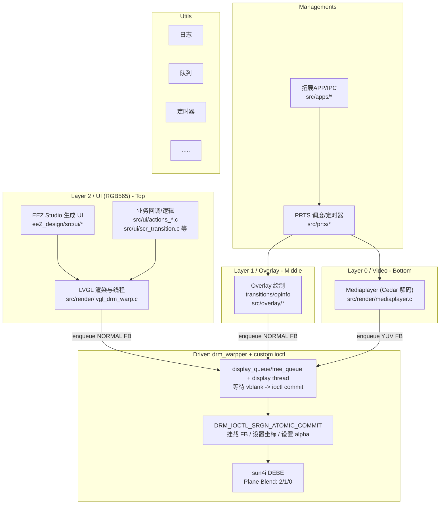

# 电子通行证播放器程序 Proj0cpy

基于DRM、LVGL和一点寄存器魔法的“方舟通行证”展示程序



## 开始使用

播放程序与电子通行证固件一起分发，可在[https://github.com/rhodesepass/buildroot/releases](https://github.com/rhodesepass/buildroot/releases)下载最新固件。

## 编译方法

### 直接编译

需要提前准备的其他源码：

* 本项目的buildroot https://github.com/rhodesepass/buildroot

构建:

1. 拉取上文提到的buildroot,按repo中readme编译一次 编译工具链及依赖库
2. 运行source ./output/host/environment-setup 将生成的工具链和依赖设置为默认工具链和依赖
3. 在本repo目录下:
```bash
mkdir build
cd build
cmake .. # 以release模式编译，或
cmake -DCMAKE_BUILD_TYPE=Debug .. # 以debug模式编译
make
```

若正常则终端显示此日志且build目录中出现epass_drm_app二进制文件

```
[100%] Built target epass_drm_app
```

### 跟随buildroot一起生成

直接拉取上文提到的buildroot,按repo中readme编译一次，生成的镜像里就有了。编译目录在output/build/epass_drm_app-xxxxx/下

## 开发指引

* [程序结构](docs/application_structure.md)
* [overlay层开发指南](docs/overlay_dev_note.md)

## 直接嵌入的开源代码

* [log](https://github.com/rxi/log.c) A minimal but powerful logging facility for C.
* [stb](https://github.com/nothings/stb) single-file public domain libraries for C/C++
* [code128](https://github.com/fhunleth/code128) barcode generator
* [lvgl](https://github.com/lvgl/lvgl) Embedded graphics library to create beautiful UIs for any MCU, MPU and display type.
* [cJSON](https://github.com/DaveGamble/cJSON) Ultralightweight JSON parser in ANSI C