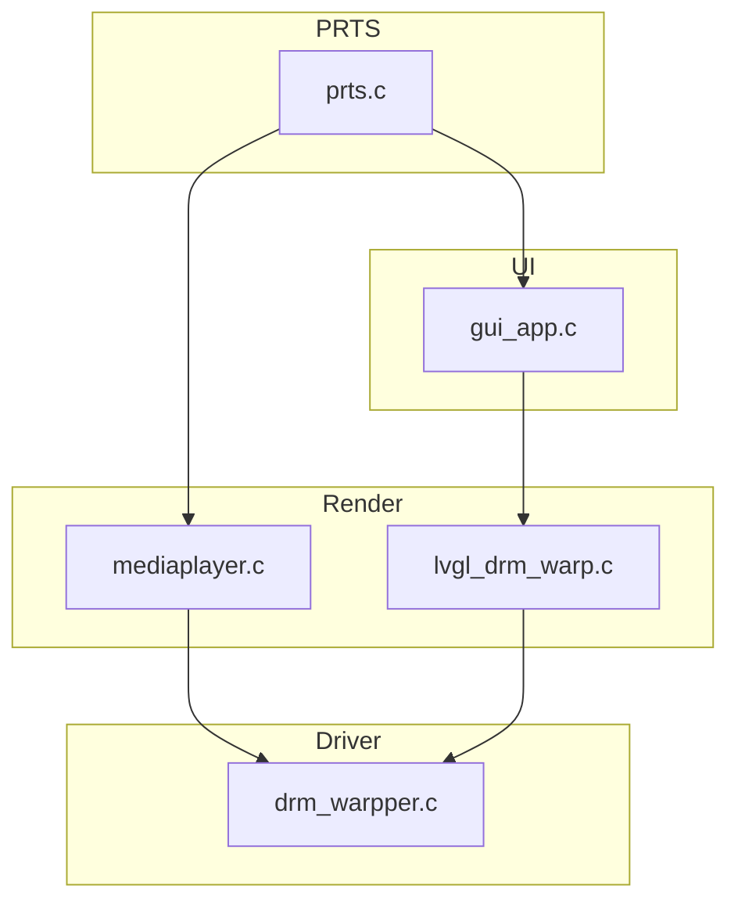

# 电子通行证播放器程序 neo版本

调用全志Cedar库，实现通行证视频播放/切换等功能。
基于LVGL实现UI，（相当于是对旧版本的重构）

[toc]

## 模块划分

### driver 显示后端模块

主要负责显示到屏幕的过程。包括DRM封装、显示线程的创建、显示队列的管理、显示缓冲区的管理等。

### render 渲染模块

主要负责渲染到缓冲区的过程。包括视频层 mediaplayer 的渲染、UI lvgl的渲染

### UI 模块

主要是lvgl的ui。与backend和middleware交互。实现用户操作、过渡动画绘制。

### PRTS 模块

Playlist Routing & Transition System。负责干员列表的切换、播放、暂停、停止等操作。

### utils 工具模块

主要负责工具函数。包括日志、队列等。



## 编译方法

需要提前准备的其他源码：

* 本项目的buildroot https://github.com/inapp123/buildroot-epass
* 全志的libcedarx https://github.com/EmperG/lindenis-v536-package/tree/master/allwinner/tina_multimedia/libcedarx

构建:

1. 拉取上文提到的buildroot,按repo中readme编译一次 编译工具链及依赖库
2. 运行source ./output/host/environment-setup 将生成的工具链和依赖设置为默认工具链和依赖
3. 将‎ board/rhodesisland/epass/rootfs/usr/lib/ 中所有文件拷贝至 output/host/arm-buildroot-linux-gnueabi/sysroot/usr/lib/
4. 将本repo clone至buildroot目录下
5. 使用[DownGit](https://minhaskamal.github.io/DownGit/#/home)等工具下载上文提到的libcedarx,将libcedarx文件夹放置在本repo文件夹下
6. 修改CMakeLists.txt,将其中所有include_directories换成自己的路径
   若完全按照上文方式操作，可以用此配置

```
include_directories(${CMAKE_CURRENT_SOURCE_DIR}/../output/host/arm-buildroot-linux-gnueabi/sysroot/usr/include/drm/)

include_directories(${CMAKE_CURRENT_SOURCE_DIR}/libcedarx/libcore/base/include)
include_directories(${CMAKE_CURRENT_SOURCE_DIR}/libcedarx/libcore/parser/include)
include_directories(${CMAKE_CURRENT_SOURCE_DIR}/libcedarx/libcore/stream/include)
include_directories(${CMAKE_CURRENT_SOURCE_DIR}/libcedarx/external/include/adecoder)
```

7. 在本repo目录下运行cmake . && make,若正常则终端显示此日志且本repo目录中出现mediaplayerd二进制文件

```
[100%] Built target mediaplayerd
```

至此编译环境搭建完毕，可以使用此环境进行进一步开发

## Overlay层 开发指南

overlay 层用于在 VIDEO 之上 UI之下绘制“过渡动画（transition）”与“干员信息（opinfo）”等覆盖效果。核心约束是：**PRTS 的 timer 回调线程必须尽快返回**，因此任何可能耗时的逐帧绘制都要放到 overlay worker 线程执行。

### 1) 线程与时序模型

- `overlay_t` 内部维护：
  - overlay 图层双缓冲（`overlay_buf_1/2`）以及对应 display queue item
  - 一个专用线程 `overlay_worker_thread`，通过 `overlay_worker_schedule()` 投递任务
  - `overlay->request_abort`：请求提前终止（例如效果未完成但要立刻停止）
  - `overlay->overlay_timer_handle`：**worker 侧清理完成的同步信号**
- `overlay_worker_schedule(overlay, func, userdata)`：
  - worker 空闲：提交任务（`func(userdata, skipped_frames)`）
  - worker 忙：丢弃这次任务并累计 `skipped_frames`（下一次执行时扣减）
- `overlay_abort(overlay)`：
  - 设置 `overlay->request_abort = 1`
  - 轮询等待 `overlay->overlay_timer_handle == 0`
  - 语义上等价于：“请求终止 overlay 效果，并等待 worker 完成资源回收/注销定时器”

> 结论：**只要你的效果创建了 `overlay->overlay_timer_handle`（也就是“需要 worker”的类型），你就必须保证在 worker 中把资源回收干净，并把 `overlay->overlay_timer_handle` 归零**，否则 `overlay_abort()` 会一直等。

### 2) 新增 Transition（过渡效果）怎么做

#### 2.1 实现与配置落点

- 实现文件：
  - `src/overlay/transitions.h`：新增类型/参数/函数声明
  - `src/overlay/transitions.c`：实现绘制与动画驱动
- 配置映射
  - `src/prts/operators.c`：把 `transition_in/transition_loop` 的字符串映射到 `transition_type_t`，并校验/填充 `oltr_params_t`

#### 2.2 不需要 worker 的 Transition（一次性绘制 + layer_animation 驱动）

适用场景：准备阶段可一次性绘制完成，运行阶段只靠 `layer_animation_*` 控制 alpha/坐标，无需逐帧重画。现有参考：`overlay_transition_fade()`、`overlay_transition_move()`。

实现步骤：

- 在入口函数内先 `overlay->request_abort = 0`
- 设置图层初始状态（例如 alpha/coord）
- `drm_warpper_dequeue_free_item()` 取一块 free buffer
- 在该 buffer 上完成一次性绘制（背景色、可选图片等）
- `drm_warpper_enqueue_display_item()` 提交显示
- 调用 `layer_animation_*` 启动动画
- 如需“中间点”做一次回调（例如遮住后挂载 video），用一次性 `prts_timer_create(..., count=1, middle_cb)` 即可

注意点：

- 这种模式通常 **不占用** `overlay->overlay_timer_handle`（例如 fade/move 的 middle timer 是局部 handle），因此也不依赖 `overlay_abort()` 的等待逻辑。

#### 2.3 需要 worker 的 Transition（timer 只 schedule，逐帧绘制在 worker）

适用场景：需要逐帧绘制。现有参考：`overlay_transition_swipe()`。

关键规则：

- **资源申请时机**：在“效果入口函数”（非 timer 回调）里申请/准备 worker 需要的资源（例如 `malloc`、贝塞尔表预计算、双缓冲清空/挂载）。不要在 timer 回调里做耗时准备。
- **驱动方式**：
  - `prts_timer_create(&overlay->overlay_timer_handle, ..., cb=timer_cb, userdata=data)`
  - `timer_cb` 里只做：`overlay_worker_schedule(overlay, worker_func, data)`
  - 真正的绘制/状态机推进在 `worker_func` 中完成
- **request_abort 处理位置**：必须在 `worker_func` 的开头检查 `overlay->request_abort`，为真则执行清理并立即返回。
- **资源回收位置**：必须在 worker 中回收（见下节原因），清理完成后必须把 `overlay->overlay_timer_handle = 0`。

### 3) 新增 OpInfo（干员信息效果）怎么做

#### 3.1 实现与配置落点

- 实现文件：
  - `src/overlay/opinfo.h`：新增类型/参数/函数声明
  - `src/overlay/opinfo.c`：实现绘制与动画驱动
- 配置映射
  - `src/prts/operators.c`：把 `overlay.type` 的字符串映射到 `opinfo_type_t`，并校验/填充 `olopinfo_params_t`

#### 3.2 不需要 worker 的 OpInfo（一次性绘制 + layer_animation 驱动）

现有参考：`overlay_opinfo_show_image()`。

实现步骤（建议顺序）：

- 在入口函数内先 `overlay->request_abort = 0`
- `drm_warpper_dequeue_free_item()` 获取 free buffer
- 一次性绘制（如位图贴图/清屏等）
- `drm_warpper_enqueue_display_item()` 提交
- 用 `layer_animation_*` 做进场/退场（例如 move）

#### 3.3 需要 worker 的 OpInfo（逐帧/局部更新）

现有参考：`overlay_opinfo_show_arknights()`。

实现步骤（建议顺序）：

- **入口函数（非 timer 回调）完成资源准备**
  - 初始化双缓冲模板（可先把静态背景画入两块 buffer）
  - 初始化 worker data（状态机参数、预计算表等；若需要 heap 内存则在这里 `malloc`）
  - `overlay->request_abort = 0`
- 创建定时器：`prts_timer_create(&overlay->overlay_timer_handle, ..., cb=timer_cb, userdata=&data)`
  - `timer_cb` 内只 schedule
- `worker_func`：
  - 开头检查 `overlay->request_abort`，为真则执行清理并返回
  - 推进状态机（可按“状态转移 → 绘制 → 交换 buffer → enqueue”的顺序写）
  - 正常结束条件满足时执行清理
- **清理（在 worker 内）**
  - `prts_timer_cancel(overlay->overlay_timer_handle)`
  - free 掉 worker 使用的 heap 资源（如有）
  - `overlay->overlay_timer_handle = 0`

### 4) 目前Overlay 编程模型的设计考量

#### 4.1 为什么资源必须在 worker 中回收？

timer虽然给出了is_last字段用来处理释放问题，但是timer 回调线程与 overlay worker 线程是并发的。如果你在 timer 回调（或其它线程）里 free 了 worker 正在访问的数据，就会出现 **UAF（Use-After-Free）**。

#### 4.2 必须保证 `overlay_timer_handle` 能归零（否则 stop 会卡死）

只要你的效果创建了 `overlay->overlay_timer_handle`：

- **正常结束路径**：最后一帧/结束条件满足时，在 worker 内 cancel timer + 回收资源 + `overlay_timer_handle=0`
- **abort 路径**：检测到 `request_abort` 时，在 worker 内 cancel timer + 回收资源 + `overlay_timer_handle=0`

否则 `overlay_abort()` 会一直阻塞等待（轮询 `overlay_timer_handle`）。

## 直接嵌入的开源代码

* [stb](https://github.com/nothings/stb) single-file public domain libraries for C/C++
* [code128](https://github.com/fhunleth/code128) barcode generator
* [lvgl](https://github.com/lvgl/lvgl) Embedded graphics library to create beautiful UIs for any MCU, MPU and display type.
* [cJSON](https://github.com/DaveGamble/cJSON) Ultralightweight JSON parser in ANSI C