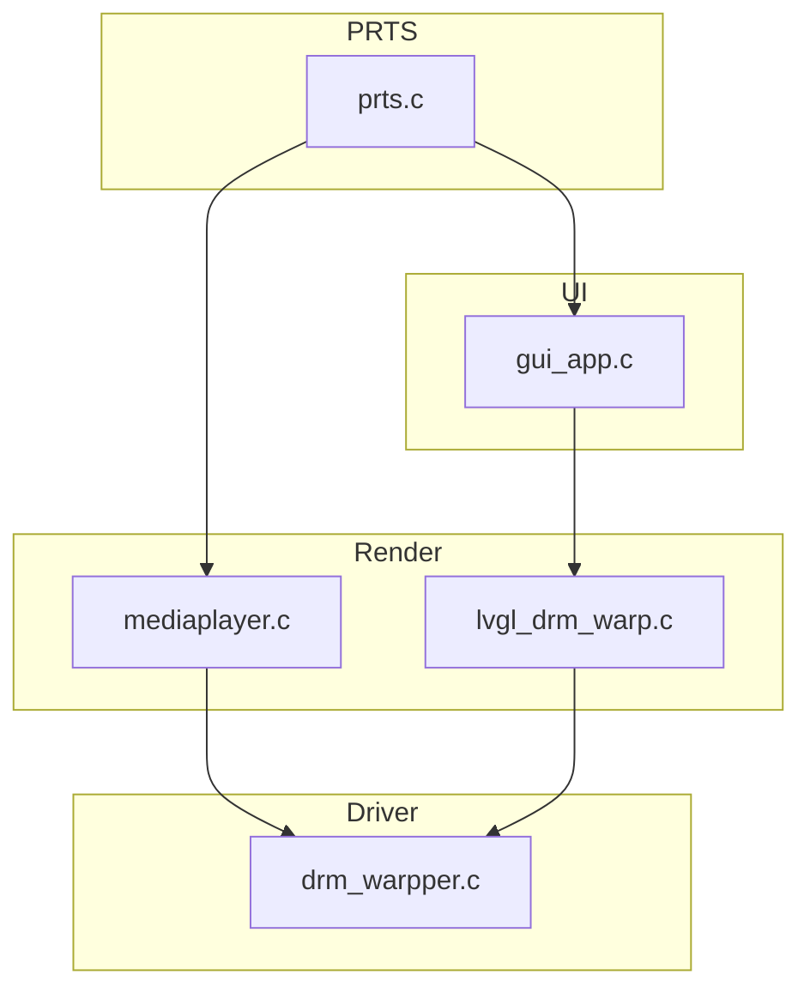

# 电子通行证播放器程序 neo版本

调用全志Cedar库，实现通行证视频播放/切换等功能。
基于LVGL实现UI，（相当于是对旧版本的重构）

## 模块划分

### driver 显示后端模块

主要负责显示到屏幕的过程。包括DRM封装、显示线程的创建、显示队列的管理、显示缓冲区的管理等。

### render 渲染模块

主要负责渲染到缓冲区的过程。包括视频层 mediaplayer 的渲染、UI lvgl的渲染

### UI 模块

主要是lvgl的ui。与backend和middleware交互。实现用户操作、过渡动画绘制。

### PRTS 模块

Playlist Routing & Transition System。负责干员列表的切换、播放、暂停、停止等操作。

### utils 工具模块

主要负责工具函数。包括日志、队列等。


## 编译方法

需要提前准备的其他源码：

* 本项目的buildroot https://github.com/inapp123/buildroot-epass
* 全志的libcedarx https://github.com/EmperG/lindenis-v536-package/tree/master/allwinner/tina_multimedia/libcedarx

构建:
1. 拉取上文提到的buildroot,按repo中readme编译一次 编译工具链及依赖库
2. 运行source ./output/host/environment-setup 将生成的工具链和依赖设置为默认工具链和依赖
3. 将‎ board/rhodesisland/epass/rootfs/usr/lib/ 中所有文件拷贝至 output/host/arm-buildroot-linux-gnueabi/sysroot/usr/lib/
4. 将本repo clone至buildroot目录下
5. 使用[DownGit](https://minhaskamal.github.io/DownGit/#/home)等工具下载上文提到的libcedarx,将libcedarx文件夹放置在本repo文件夹下
6. 修改CMakeLists.txt,将其中所有include_directories换成自己的路径
若完全按照上文方式操作，可以用此配置
```
include_directories(${CMAKE_CURRENT_SOURCE_DIR}/../output/host/arm-buildroot-linux-gnueabi/sysroot/usr/include/drm/)

include_directories(${CMAKE_CURRENT_SOURCE_DIR}/libcedarx/libcore/base/include)
include_directories(${CMAKE_CURRENT_SOURCE_DIR}/libcedarx/libcore/parser/include)
include_directories(${CMAKE_CURRENT_SOURCE_DIR}/libcedarx/libcore/stream/include)
include_directories(${CMAKE_CURRENT_SOURCE_DIR}/libcedarx/external/include/adecoder)
```
7. 在本repo目录下运行cmake . && make,若正常则终端显示此日志且本repo目录中出现mediaplayerd二进制文件
```
[100%] Built target mediaplayerd
```
至此编译环境搭建完毕，可以使用此环境进行进一步开发
