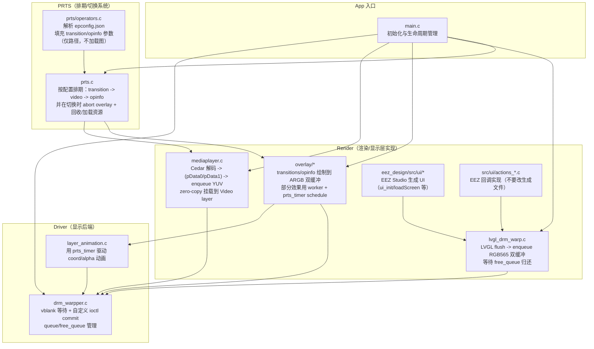
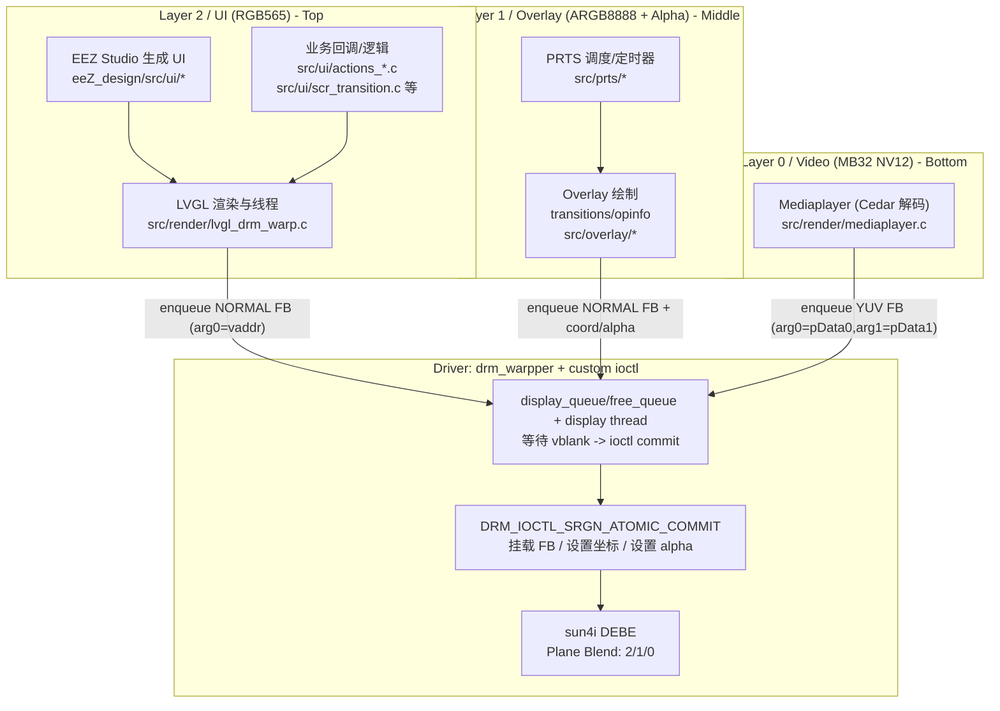

# 电子通行证播放器程序 neo版本

调用全志Cedar库，实现通行证视频播放/切换等功能。
基于LVGL实现UI，（相当于是对旧版本的重构）

[toc]

## 模块划分

### driver 显示后端模块

主要负责把各业务模块提交的“图层更新请求”真正显示到屏幕上：

- 基于 DRM 的 plane 初始化（modeset）与 buffer 分配（dumb buffer）
- 维护每个 layer 的 `display_queue/free_queue`
- 创建 display thread：每次等待 vblank（vsync）后，用自定义 ioctl `DRM_IOCTL_SRGN_ATOMIC_COMMIT` 合并提交挂载 FB / 设置坐标 / 设置 alpha

这一层的核心文件是 `src/driver/drm_warpper.c`（以及 ioctl 定义 `src/driver/srgn_drm.h`）。

### render 渲染模块

主要负责把“视频/overlay/ui”渲染成可以被 `drm_warpper` 挂载显示的 buffer：

- **Video（`src/render/mediaplayer.c`）**：调用 Cedar 解码，拿到解码输出的用户地址 `pData0/pData1`，zero-copy enqueue 到 video layer，最终在 vblank 时由 `drm_warpper` 通过 ioctl 喂给内核完成挂载
- **UI（`src/render/lvgl_drm_warp.c`）**：把 LVGL 的 flush 输出直接写到 RGB565 双缓冲并 enqueue；并通过 `free_queue` 等待 vsync 后 buffer 归还
- **Overlay（`src/overlay/*`）**：过渡/干员信息绘制到 ARGB 双缓冲；耗时逐帧效果用 overlay worker（避免卡住 PRTS timer 回调）

### UI 模块

UI 主要由 EEZ Studio 生成并在 LVGL 线程中运行：

- **生成代码**：`eez_design/src/ui/*`（`ui_init/loadScreen`、screens/images/styles 等）
- **业务回调/逻辑**：`src/ui/actions_*.c`、`src/ui/scr_transition.c`、`src/ui/filemanager.c` 等

注意：**不要直接修改 `eez_design/src/ui/*` 的生成文件**，应修改 EEZ Studio 工程后重新生成，以免破坏关联性。

### PRTS 模块

Playlist Routing & Transition System（排期/切换系统），负责干员资源与播放流程的“编排”：

- 解析干员 `epconfig.json`（`src/prts/operators.c`），得到 `transition_in/transition_loop/opinfo` 参数（图片只填路径，实际加载由 overlay 层执行）
- 在 `src/prts/prts.c` 中按配置排期执行：transition → 切换视频（mediaplayer）→ opinfo
- 干员切换时会 `overlay_abort()` 请求终止 overlay 并等待其在 worker 内完成回收，然后再进行新干员资源加载/排期

### utils 工具模块

主要负责通用工具与基础设施：日志（log）、队列（spsc_queue）、timer（prts_timer）、JSON/UUID 等。



## 按显示层（Plane）划分的结构图

本项目实际使用 **3 个层/Plane**：

- **Layer 0：Video**（`MB32 NV12`，用于视频解码输出，来自 DEFE）
- **Layer 1：Overlay**（`ARGB8888`，用于过渡/干员信息等覆盖绘制，可使用像素 alpha / 或寄存器 alpha）
- **Layer 2：UI**（`RGB565`，用于 LVGL UI）

实际混叠顺序为 **2/1/0 自上而下**，由 sun4i 的 **DEBE** 完成。



### sun4i / DEBE 的关键限制

- 物理上虽有 **4 个层**，但同时最多：
  - **1 个视频层**（数据从 DEFE 导入，用于视频解码输出）
  - **1 个带透明度的层**（RGBA 像素 alpha 或寄存器 alpha）
- 本工程的取舍是：Video 用 YUV（MB32 NV12），Overlay 用 ARGB（承担透明度层），UI 用 RGB565（尽量不占用透明度能力）。

更多背景可参考文档：[定制 ioctl 文档](https://ep.iccmc.cc/guide/develop/custom_ioctl.html)。

### `drm_warpper`（显示后端）

- `drm_warpper` 负责把“各层提交的显示请求”在 **vblank** 时刻合并并通过 ioctl 一次性提交给内核（降低 modeset/寄存器开销）。
- 基本用法（按层）：
  - `drm_warpper_init_layer(layer_id, w, h, mode)` 初始化层（队列等）
  - `drm_warpper_allocate_buffer()` 申请 dumb buffer（适用于 UI/Overlay 双缓冲；Video 层一般不靠此 buffer 输出内容）
  - **先 modeset**：`drm_warpper_mount_layer()`（`drmModeSetPlane`）把 layer 跑起来，然后再进入“每帧 ioctl commit”的快速路径
  - 每帧/每次更新：`drm_warpper_enqueue_display_item()` 提交 item（挂载 FB / set coord / set alpha）
  - 同步/回收：通过 `drm_warpper_dequeue_free_item()` 从 `free_queue` 拿到“上一帧已完成切换”的 item，用于复用 buffer 或归还解码帧
- 内核会缓存“用户态地址 → 物理地址”的映射，因此程序启动时会 reset cache（避免上次运行残留）。

### Video 层（`mediaplayer`）

- `mediaplayer` 通过 Cedar 解码得到 `VideoPicture`，其 `pData0/pData1` 是 **用户态地址**。
- 零拷贝路径：把 `pData0/pData1` 填入 `DRM_SRGN_ATOMIC_COMMIT_MOUNT_FB_YUV` 的 `arg0/arg1`，enqueue 给 `drm_warpper`，由 display thread 在 vblank 时 ioctl 提交给内核完成挂载/切换。
- 解码帧回收：`mediaplayer` 会从 video layer 的 `free_queue` 取回旧帧 item，并对其中保存的 `VideoPicture*` 调用 `ReturnPicture()`，避免解码器缓冲耗尽。

### UI 层（`lvgl_drm_warpper` + EEZ Studio）

- 初始化入口在 `src/render/lvgl_drm_warp.c`：
  - 申请 UI 层双缓冲（RGB565），并先 modeset
  - LVGL flush 回调里 enqueue framebuffer，然后通过 `free_queue` 等待 vsync 后 buffer 归还，再 `lv_display_flush_ready()`
- LVGL 初始化完成后，会调用 EEZ Studio 生成的 `ui_init()` / `loadScreen()` 等创建 UI。
- **不要直接修改生成代码**：`eez_design/src/ui/*` 属于 EEZ Studio 导出产物，建议修改 EEZ 工程后重新生成；项目侧业务逻辑/回调请写在 `src/ui/actions_*.c` 等文件中，以免破坏生成关联。

## 编译方法

需要提前准备的其他源码：

* 本项目的buildroot https://github.com/inapp123/buildroot-epass

构建:

1. 拉取上文提到的buildroot,按repo中readme编译一次 编译工具链及依赖库
2. 运行source ./output/host/environment-setup 将生成的工具链和依赖设置为默认工具链和依赖
3. 在本repo目录下运行cmake . && make,若正常则终端显示此日志且本repo目录中出现epass_drm_app二进制文件

```
[100%] Built target epass_drm_app
```

至此编译环境搭建完毕，可以使用此环境进行进一步开发

## Overlay层 开发指南

overlay 层用于在 VIDEO 之上 UI之下绘制“过渡动画（transition）”与“干员信息（opinfo）”等覆盖效果。核心约束是：**PRTS 的 timer 回调线程必须尽快返回**，因此任何可能耗时的逐帧绘制都要放到 overlay worker 线程执行。

### 1) 线程与时序模型

- `overlay_t` 内部维护：
  - overlay 图层双缓冲（`overlay_buf_1/2`）以及对应 display queue item
  - 一个专用线程 `overlay_worker_thread`，通过 `overlay_worker_schedule()` 投递任务
  - `overlay->request_abort`：请求提前终止（例如效果未完成但要立刻停止）
  - `overlay->overlay_timer_handle`：**worker 侧清理完成的同步信号**
- `overlay_worker_schedule(overlay, func, userdata)`：
  - worker 空闲：提交任务（`func(userdata, skipped_frames)`）
  - worker 忙：丢弃这次任务并累计 `skipped_frames`（下一次执行时扣减）
- `overlay_abort(overlay)`：
  - 设置 `overlay->request_abort = 1`
  - 轮询等待 `overlay->overlay_timer_handle == 0`
  - 语义上等价于：“请求终止 overlay 效果，并等待 worker 完成资源回收/注销定时器”

> 结论：**只要你的效果创建了 `overlay->overlay_timer_handle`（也就是“需要 worker”的类型），你就必须保证在 worker 中把资源回收干净，并把 `overlay->overlay_timer_handle` 归零**，否则 `overlay_abort()` 会一直等。

### 2) 新增 Transition（过渡效果）怎么做

#### 2.1 实现与配置落点

- 实现文件：
  - `src/overlay/transitions.h`：新增类型/参数/函数声明
  - `src/overlay/transitions.c`：实现绘制与动画驱动
- 配置映射
  - `src/prts/operators.c`：把 `transition_in/transition_loop` 的字符串映射到 `transition_type_t`，并校验/填充 `oltr_params_t`

#### 2.2 不需要 worker 的 Transition（一次性绘制 + layer_animation 驱动）

适用场景：准备阶段可一次性绘制完成，运行阶段只靠 `layer_animation_*` 控制 alpha/坐标，无需逐帧重画。现有参考：`overlay_transition_fade()`、`overlay_transition_move()`。

实现步骤：

- 在入口函数内先 `overlay->request_abort = 0`
- 设置图层初始状态（例如 alpha/coord）
- `drm_warpper_dequeue_free_item()` 取一块 free buffer
- 在该 buffer 上完成一次性绘制（背景色、可选图片等）
- `drm_warpper_enqueue_display_item()` 提交显示
- 调用 `layer_animation_*` 启动动画
- 如需“中间点”做一次回调（例如遮住后挂载 video），用一次性 `prts_timer_create(..., count=1, middle_cb)` 即可

注意点：

- 这种模式通常 **不占用** `overlay->overlay_timer_handle`（例如 fade/move 的 middle timer 是局部 handle），因此也不依赖 `overlay_abort()` 的等待逻辑。

#### 2.3 需要 worker 的 Transition（timer 只 schedule，逐帧绘制在 worker）

适用场景：需要逐帧绘制。现有参考：`overlay_transition_swipe()`。

关键规则：

- **资源申请时机**：在“效果入口函数”（非 timer 回调）里申请/准备 worker 需要的资源（例如 `malloc`、贝塞尔表预计算、双缓冲清空/挂载）。不要在 timer 回调里做耗时准备。
- **驱动方式**：
  - `prts_timer_create(&overlay->overlay_timer_handle, ..., cb=timer_cb, userdata=data)`
  - `timer_cb` 里只做：`overlay_worker_schedule(overlay, worker_func, data)`
  - 真正的绘制/状态机推进在 `worker_func` 中完成
- **request_abort 处理位置**：必须在 `worker_func` 的开头检查 `overlay->request_abort`，为真则执行清理并立即返回。
- **资源回收位置**：必须在 worker 中回收（见下节原因），清理完成后必须把 `overlay->overlay_timer_handle = 0`。

### 3) 新增 OpInfo（干员信息效果）怎么做

#### 3.1 实现与配置落点

- 实现文件：
  - `src/overlay/opinfo.h`：新增类型/参数/函数声明
  - `src/overlay/opinfo.c`：实现绘制与动画驱动
- 配置映射
  - `src/prts/operators.c`：把 `overlay.type` 的字符串映射到 `opinfo_type_t`，并校验/填充 `olopinfo_params_t`

#### 3.2 不需要 worker 的 OpInfo（一次性绘制 + layer_animation 驱动）

现有参考：`overlay_opinfo_show_image()`。

实现步骤（建议顺序）：

- 在入口函数内先 `overlay->request_abort = 0`
- `drm_warpper_dequeue_free_item()` 获取 free buffer
- 一次性绘制（如位图贴图/清屏等）
- `drm_warpper_enqueue_display_item()` 提交
- 用 `layer_animation_*` 做进场/退场（例如 move）

#### 3.3 需要 worker 的 OpInfo（逐帧/局部更新）

现有参考：`overlay_opinfo_show_arknights()`。

实现步骤（建议顺序）：

- **入口函数（非 timer 回调）完成资源准备**
  - 初始化双缓冲模板（可先把静态背景画入两块 buffer）
  - 初始化 worker data（状态机参数、预计算表等；若需要 heap 内存则在这里 `malloc`）
  - `overlay->request_abort = 0`
- 创建定时器：`prts_timer_create(&overlay->overlay_timer_handle, ..., cb=timer_cb, userdata=&data)`
  - `timer_cb` 内只 schedule
- `worker_func`：
  - 开头检查 `overlay->request_abort`，为真则执行清理并返回
  - 推进状态机（可按“状态转移 → 绘制 → 交换 buffer → enqueue”的顺序写）
  - 正常结束条件满足时执行清理
- **清理（在 worker 内）**
  - `prts_timer_cancel(overlay->overlay_timer_handle)`
  - free 掉 worker 使用的 heap 资源（如有）
  - `overlay->overlay_timer_handle = 0`

### 4) 目前Overlay 编程模型的设计考量

#### 4.1 为什么资源必须在 worker 中回收？

timer虽然给出了is_last字段用来处理释放问题，但是timer 回调线程与 overlay worker 线程是并发的。如果你在 timer 回调（或其它线程）里 free 了 worker 正在访问的数据，就会出现 **UAF（Use-After-Free）**。

#### 4.2 必须保证 `overlay_timer_handle` 能归零（否则 stop 会卡死）

只要你的效果创建了 `overlay->overlay_timer_handle`：

- **正常结束路径**：最后一帧/结束条件满足时，在 worker 内 cancel timer + 回收资源 + `overlay_timer_handle=0`
- **abort 路径**：检测到 `request_abort` 时，在 worker 内 cancel timer + 回收资源 + `overlay_timer_handle=0`

否则 `overlay_abort()` 会一直阻塞等待（轮询 `overlay_timer_handle`）。

## 直接嵌入的开源代码

* [log](https://github.com/rxi/log.c) A minimal but powerful logging facility for C.
* [stb](https://github.com/nothings/stb) single-file public domain libraries for C/C++
* [code128](https://github.com/fhunleth/code128) barcode generator
* [lvgl](https://github.com/lvgl/lvgl) Embedded graphics library to create beautiful UIs for any MCU, MPU and display type.
* [cJSON](https://github.com/DaveGamble/cJSON) Ultralightweight JSON parser in ANSI C