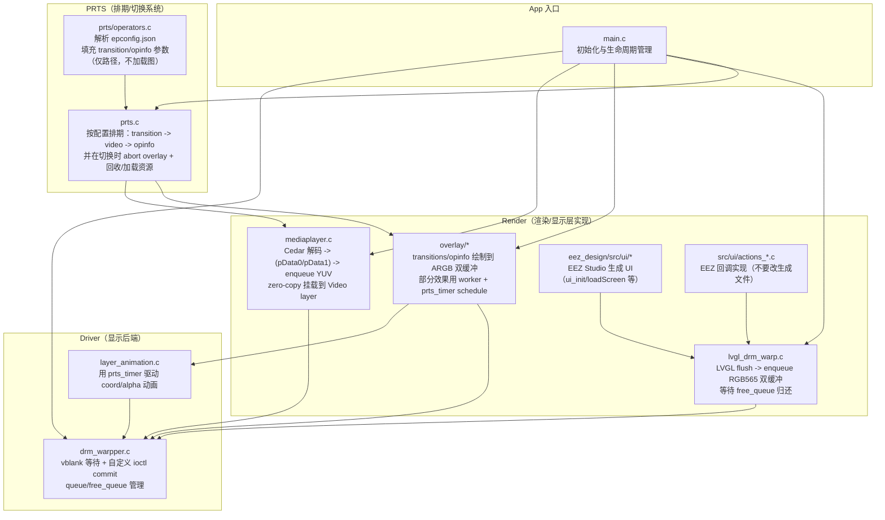
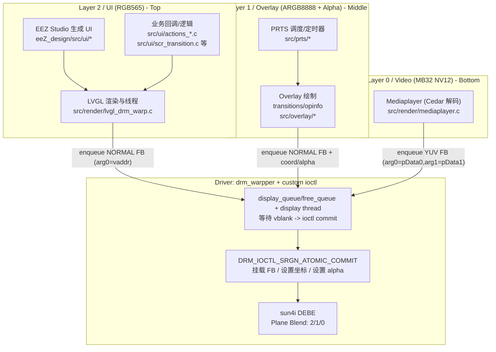

# 应用结构

## 模块划分

### driver 显示后端模块

主要负责把各业务模块提交的“图层更新请求”真正显示到屏幕上：

- 基于 DRM 的 plane 初始化（modeset）与 buffer 分配（dumb buffer）
- 维护每个 layer 的 `display_queue/free_queue`
- 创建 display thread：每次等待 vblank（vsync）后，用自定义 ioctl `DRM_IOCTL_SRGN_ATOMIC_COMMIT` 合并提交挂载 FB / 设置坐标 / 设置 alpha

这一层的核心文件是 `src/driver/drm_warpper.c`（以及 ioctl 定义 `src/driver/srgn_drm.h`）。

### render 渲染模块

主要负责把“视频/overlay/ui”渲染成可以被 `drm_warpper` 挂载显示的 buffer：

- **Video（`src/render/mediaplayer.c`）**：调用 Cedar 解码，拿到解码输出的用户地址 `pData0/pData1`，zero-copy enqueue 到 video layer，最终在 vblank 时由 `drm_warpper` 通过 ioctl 喂给内核完成挂载
- **UI（`src/render/lvgl_drm_warp.c`）**：把 LVGL 的 flush 输出直接写到 RGB565 双缓冲并 enqueue；并通过 `free_queue` 等待 vsync 后 buffer 归还
- **Overlay（`src/overlay/*`）**：过渡/干员信息绘制到 ARGB 双缓冲；耗时逐帧效果用 overlay worker（避免卡住 PRTS timer 回调）

### UI 模块

UI 主要由 EEZ Studio 生成并在 LVGL 线程中运行：

- **生成代码**：`eez_design/src/ui/*`（`ui_init/loadScreen`、screens/images/styles 等）
- **业务回调/逻辑**：`src/ui/actions_*.c`、`src/ui/scr_transition.c`、`src/ui/filemanager.c` 等

注意：**不要直接修改 `eez_design/src/ui/*` 的生成文件**，应修改 EEZ Studio 工程后重新生成，以免破坏关联性。

### PRTS 模块

Playlist Routing & Transition System（排期/切换系统），负责干员资源与播放流程的“编排”：

- 解析干员 `epconfig.json`（`src/prts/operators.c`），得到 `transition_in/transition_loop/opinfo` 参数（图片只填路径，实际加载由 overlay 层执行）
- 在 `src/prts/prts.c` 中按配置排期执行：transition → 切换视频（mediaplayer）→ opinfo
- 干员切换时会 `overlay_abort()` 请求终止 overlay 并等待其在 worker 内完成回收，然后再进行新干员资源加载/排期

### utils 工具模块

主要负责通用工具与基础设施：日志（log）、队列（spsc_queue）、timer（prts_timer）、JSON/UUID 等。

## 按显示层（Plane）划分的结构图

本项目实际使用 **3 个层/Plane**：

- **Layer 0：Video**（`MB32 NV12`，用于视频解码输出，来自 DEFE）
- **Layer 1：Overlay**（`ARGB8888`，用于过渡/干员信息等覆盖绘制，可使用像素 alpha / 或寄存器 alpha）
- **Layer 2：UI**（`RGB565`，用于 LVGL UI）

实际混叠顺序为 **2/1/0 自上而下**，由 sun4i 的 **DEBE** 完成。

### sun4i / DEBE 的关键限制

- 物理上虽有 **4 个层**，但同时最多：
  - **1 个视频层**（数据从 DEFE 导入，用于视频解码输出）
  - **1 个带透明度的层**（RGBA 像素 alpha 或寄存器 alpha）
- 本工程的取舍是：Video 用 YUV（MB32 NV12），Overlay 用 ARGB（承担透明度层），UI 用 RGB565（尽量不占用透明度能力）。

更多背景可参考文档：[定制 ioctl 文档](https://ep.iccmc.cc/guide/develop/custom_ioctl.html)。

### `drm_warpper`（显示后端）

- `drm_warpper` 负责把“各层提交的显示请求”在 **vblank** 时刻合并并通过 ioctl 一次性提交给内核（降低 modeset/寄存器开销）。
- 基本用法（按层）：
  - `drm_warpper_init_layer(layer_id, w, h, mode)` 初始化层（队列等）
  - `drm_warpper_allocate_buffer()` 申请 dumb buffer（适用于 UI/Overlay 双缓冲；Video 层一般不靠此 buffer 输出内容）
  - **先 modeset**：`drm_warpper_mount_layer()`（`drmModeSetPlane`）把 layer 跑起来，然后再进入“每帧 ioctl commit”的快速路径
  - 每帧/每次更新：`drm_warpper_enqueue_display_item()` 提交 item（挂载 FB / set coord / set alpha）
  - 同步/回收：通过 `drm_warpper_dequeue_free_item()` 从 `free_queue` 拿到“上一帧已完成切换”的 item，用于复用 buffer 或归还解码帧
- 内核会缓存“用户态地址 → 物理地址”的映射，因此程序启动时会 reset cache（避免上次运行残留）。

### Video 层（`mediaplayer`）

- `mediaplayer` 通过 Cedar 解码得到 `VideoPicture`，其 `pData0/pData1` 是 **用户态地址**。
- 零拷贝路径：把 `pData0/pData1` 填入 `DRM_SRGN_ATOMIC_COMMIT_MOUNT_FB_YUV` 的 `arg0/arg1`，enqueue 给 `drm_warpper`，由 display thread 在 vblank 时 ioctl 提交给内核完成挂载/切换。
- 解码帧回收：`mediaplayer` 会从 video layer 的 `free_queue` 取回旧帧 item，并对其中保存的 `VideoPicture*` 调用 `ReturnPicture()`，避免解码器缓冲耗尽。

### UI 层（`lvgl_drm_warpper` + EEZ Studio）

- 初始化入口在 `src/render/lvgl_drm_warp.c`：
  - 申请 UI 层双缓冲（RGB565），并先 modeset
  - LVGL flush 回调里 enqueue framebuffer，然后通过 `free_queue` 等待 vsync 后 buffer 归还，再 `lv_display_flush_ready()`
- LVGL 初始化完成后，会调用 EEZ Studio 生成的 `ui_init()` / `loadScreen()` 等创建 UI。
- **不要直接修改生成代码**：`eez_design/src/ui/*` 属于 EEZ Studio 导出产物，建议修改 EEZ 工程后重新生成；项目侧业务逻辑/回调请写在 `src/ui/actions_*.c` 等文件中，以免破坏生成关联。